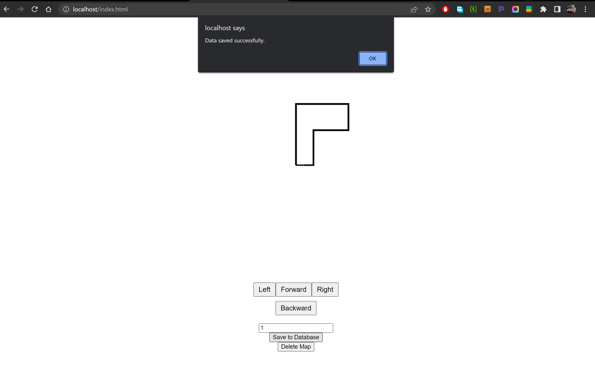

# RobotMap
Robot Map to draw a map of the robot's path and you can save the path in the database using save_data code

## Map Page

There is buttons that contains the directions of the robot's path and the user should enter the distance traveled in meters. For instance, the user enter the distance and then clicks Left, a one meter line will be drawn to the left in the middile of the page.

## Mapping.html
In this file, the layout and design of the map page are defined. Also, the code contain JavaScript code to draw the map and it contains functions to do multiple tasks. And it contains saveToDatabase function that saves both direction and distance inserted by the user to a table named map in the database. The data saved to the database are stored in an array before saving it to the database. As shown in the picture below:

## save_data.php
This code connect to the database using cridintials, and then inserts direction and distance stored in array.

## Note: 
All the functions in the codes have explaining comments for you to understand easily.
